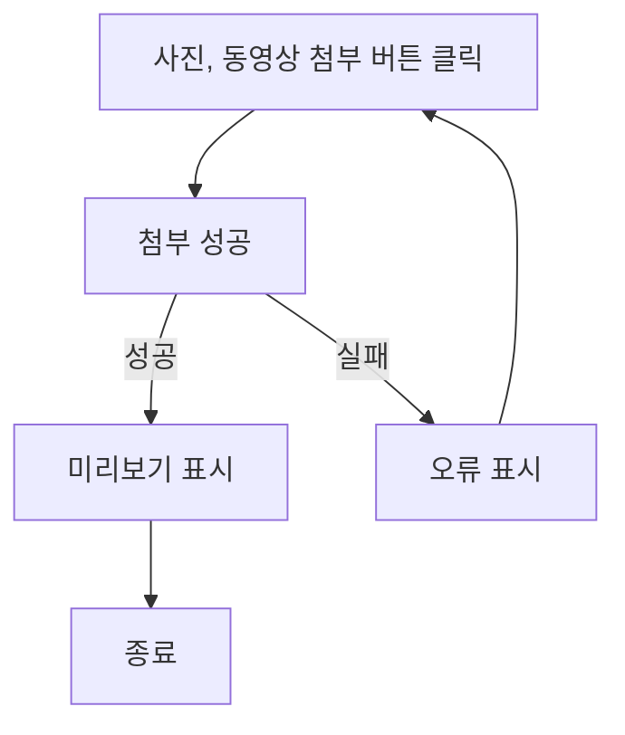
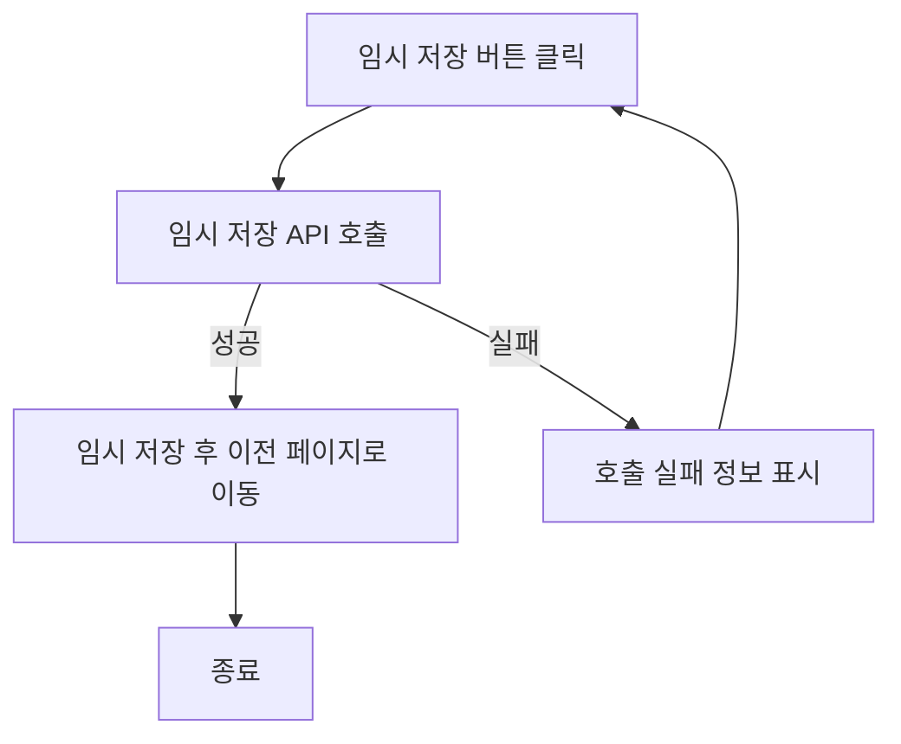
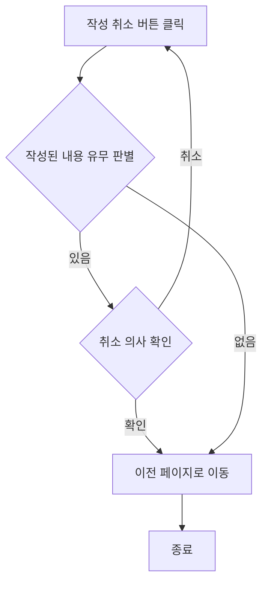
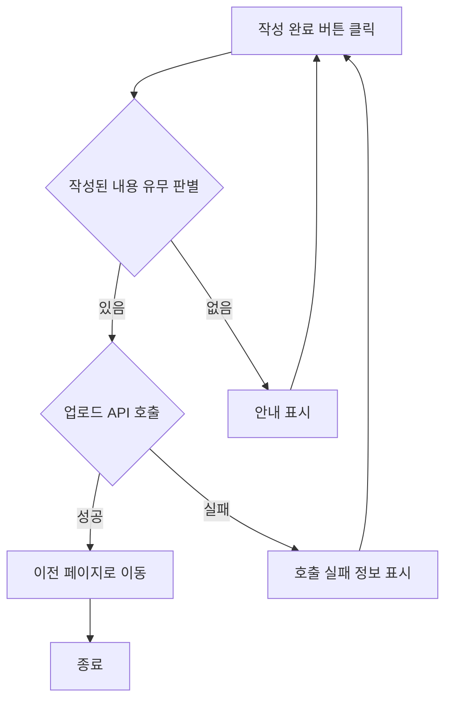
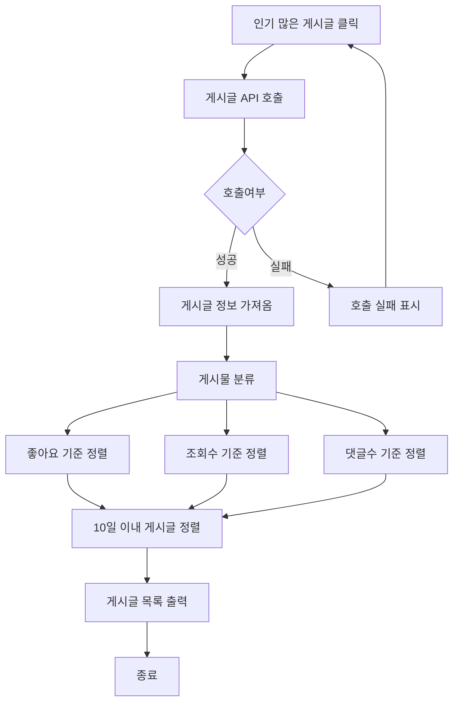
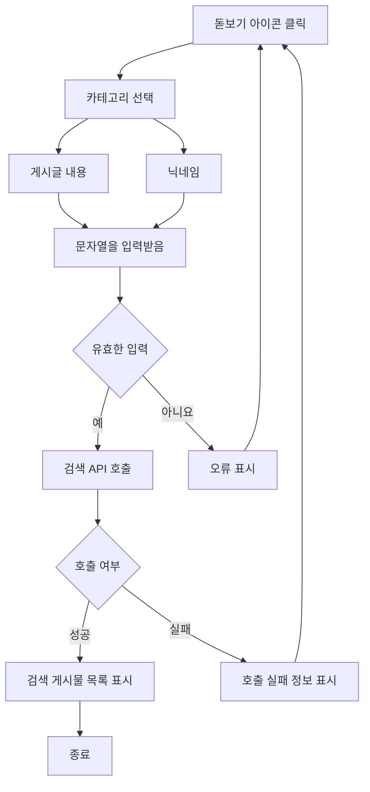
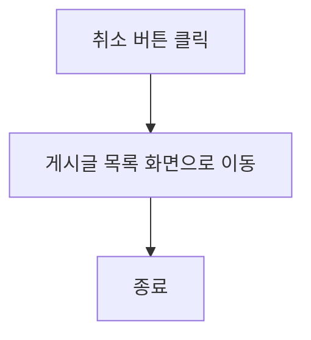

## 글 작성 사용자 스토리

### 커뮤니티 이용자로서, 나는 피드에 새로운 글을 작성하여 업로드하고 싶습니다.

#### 기능명: 글 작성

- 기능 설명
    - 사용자가 커뮤니티 피드에 글을 작성하여 다른 사용자에게 노출시킬 수 있다.
- 입력 항목
    - 글 본문

#### 사용자 액션

**사진, 동영상 첨부**

- 사진, 동영상 첨부 버튼 클릭
    - 선택된 파일 호출 시도
    - 호출 실패 시 첨부 절차가 취소되며, 사용자에게 오류 정보 알림
    - 호출 성공 시 첨부된 파일 미리보기 표시



- 임시 저장 버튼 클릭
    - 임시 저장 API 호출
    - API 호출 실패 시 임시 저장 절차는 종료되며 사용자에게 호출 실패 정보 알림
    - API 호출 성공 후 이전 페이지로 이동



- 작성 취소 버튼 클릭
    - 작성된 내용 유무 판별
    - 작성된 내용이 없는 경우 이전 페이지로 이동
    - 작성된 내용이 있는 경우 취소 의사 확인 후 이전 페이지로 이동



- 작성 완료 버튼 클릭
    - 작성된 내용 유무 판별
    - 작성된 내용이 없는 경우 사용자에게 해당 사항을 안내
    - 작성된 내용이 있는 경우 업로드 API 호출
    - API 호출 실패 시 업로드 절차는 종료되며 사용자에게 호출 실패 정보 알림
    - API 호출 성공 후 이전 페이지로 이동




## 인기 게시글 사용자 스토리

### 나는 최근 다른 사람들의 관심이 많은 게시글을 보고 싶습니다. 그래서 내가 원하는 게시글과 현재 트랜드 확인할 수 있습니다.

#### 기능 명: 인기 많은 게시글

- 기능 설명: 좋아요, 조회수, 댓글 등 사용자가 원하는 것을 기준으로 가장 많은 상위 게시물을 우선적으로 나타낼 수 있다.
- 주요 기능:
    - 좋아요, 조회수, 댓글 순 정렬 기능

#### 사용자 액션: “인기 많은 게시글” 클릭

- 게시글 API  호출
- API 호출 성공 후 게시물 정보 가져옴
- API 호출 실패시 호출 실패 표시
- 게시물 정보 분류
- 좋아요, 조회수, 댓글수 기준 정렬
- 최근 10일 이내 게시글 정렬
- 게시글 목록 출력



## 게시글 검색 사용자 스토리

### 일반 회원으로서, 내가 원하는 조건대로 게시글을 찾고 싶습니다. 따라서 내가 원하는 게시글을 찾을 수 있습니다.

**기능명 :  게시글 검색**

- 기능 설명
    - 일반 회원 및 사업자 회원은 검색 기능을 사용하여 사용자가 원하는 조건에 부합하는 게시글을 찾을 수 있다.
- 주요 기능:
    - 검색 바 제공
    - 제목, 작성자를 키워드로 검색 가능
    - 검색 결과 필터링 (카테고리 및 키워드)
    - 최근 검색 기록 저장
- 입력 항목
    - 게시글 제목 : 문자열, 최대 10글자
    - 닉네임 : 문자열, 최대 6글자
    - *~~패스워드 : 문자열 최대 10글자(유효성 검사 필요)~~*
    - *~~작성일 : 날짜 (yyyy-mm-dd 형식)~~*

**사용자 액션**

검색

- 돋보기 아이콘 클릭/검색 버튼 클릭
    - 게시글 제목/닉네임 카테고리 선택
    - 문자열을 입력받음
    - 해당 카테고리에 입력받은 문자열이 존재하는지 검사
    - 오류 발생시 검색 절차는 종료되며 사용자에게 오류 정보 알림
    - 검사 통과시 검색  API 호출
    - API 호출 성공 후 검색 게시물 목록  표시



---
- 취소 버튼 클릭
    - 게시글 목록 화면으로 전환





    
## 게시글 검색 사용자 스토리
    
### 일반/사업자 회원으로서 광고, 욕설, 비방 등으로 불쾌함을 느껴 게시물 또는 댓글의 작성자를 신고하려 합니다.
    
### 따라서 클린한 글 · 댓글 문화를 만들고자 합니다.
    
**기능명 : 신고 기능**
    
- 기능 설명
    - 사용자가 광고, 욕설, 비방 등으로 인해 불쾌함을 느껴 신고하고 이를 통해 관리자가 관리함으로써 클린한 게시글 및 댓글 문화를 유지할 수 있다.
    - 입력 항목
        - 신고사유 : 선택형 목록(프론트엔드에서 제공)
        - 사유에 따라 추가 정보 : 문자열, 최대 100자
        - 신고 날짜 :  날짜 (yyyy-mm-dd 형식)
    
**사용자 액션**
    
**신고**
    
- 산고 버튼 클릭
    - 사유 카테고리 선택 검사 실행
    - 사유 카테고리 선택 검사 오류 발생시 사용자에게 오류 정보 알림
    - 입력 항목 유효성 검사 실행
    - 유효성 검사 오류 발생시  사용자에게 오류 정보 알림
    - 사유 카테고리 선택 검사 및 유효성 검사 통과시 등록 API 호출
    - API 호출 성공 후 요약 정보 표시
    - 해당 게시글 화면으로 전환
    ```mermaid
    flowchart TD
        A[신고 버튼 클릭] --> B[입력 및 선택 항목 유효성 검사]
        B --> C{유효한 입력}
        C -- 예 --> D[등록 API 호출]
        C -- 아니요 --> E[사용자에게 오류 정보 알림]
        E --> A
        D --> F{API 호출 여부}
        F -- 성공 --> G[요약 정보 표시]
        F -- 실패 --> H[호출 실패 정보 표시]
        H --> A
        G --> I[해당 게시글 화면으로 전환]
        I --> Z[종료]

    ```

    ---
- 취소 버튼 클릭
    - 해당 게시글 화면으로 전환
        
    ```mermaid
    flowchart TD
    A[취소 버튼 클릭] --> B[설정 화면으로 이동]
    B --> Z[종료]
    ```
        
    
## 회원 관리 관리자 스토리
    
### 웹/앱 관리자로서 일반/사업자 계정을 관리하고 싶습니다. 고객 이해, 맞춤형 서비스 제공의 이점을 얻고자 합니다.
    
**기능명 : 회원 관리**
    
- 기능 설명
    - 웹/앱 관리자가 회원들의 계정을 정지 또는 삭제함으로써 계정을 관리 할 수 있다.
    - 입력 항목
        - *회원 닉네임 : 문자열 , 최대 10글자*
        - 제재 사유 : 문자열, 최대 100글자
        - 제재 관리 : 선택형 목록(프론트엔드에서 제공) ~~정지 or 삭제~~
        - *제재 날짜 : (yyyy-mm—dd 형식)*
    
    **사용자 액션**
    
    **관리**
    
    - 관리 버튼 클릭
        - 사유 카테고리 선택 검사 실행
        - 사유 카테고리 선택 검사 오류 발생시 사용자에게 오류 정보 알림
        - 입력 항목 유효성 검사 실행
        - 유효성 검사 오류 발생시  사용자에게 오류 정보 알림
        - 사유 카테고리 선택 검사 및 유효성 검사 통과시 등록 API 호출
        - API 호출 성공 후 요약 정보 표시
        - 해당 설정 화면으로 전환
        
    ```mermaid
    flowchart TD
        A[관리 버튼 클릭] --> B[입력 및 선택 항목 유효성 검사]
        B --> C{유효한 입력}
        C -- 예 --> D[등록 API 호출]
        C -- 아니요 --> E[사용자에게 오류 정보 알림]
        E --> A
        D --> F{API 호출 여부}
        F -- 성공 --> G[요약 정보 표시]
        F -- 실패 --> H[호출 실패 정보 표시]
        H --> A
        G --> I[해당 게시글 화면으로 전환]
        I --> Z[종료]
    ```

    ---
        
    - 취소 버튼 클릭
        - 해당 설정 화면으로 전환    
    ```mermaid
    flowchart TD
        A[취소 버튼 클릭] --> B[설정 화면으로 이동]
        B --> Z[종료]
    ```