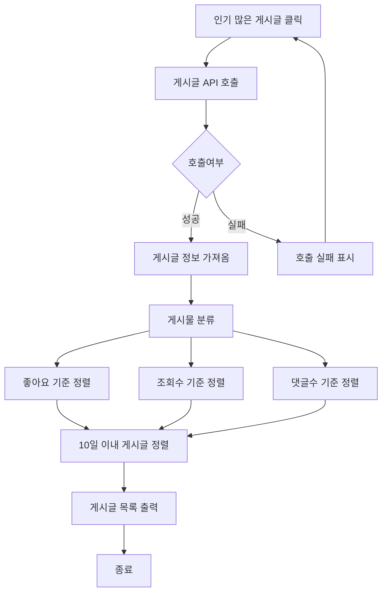
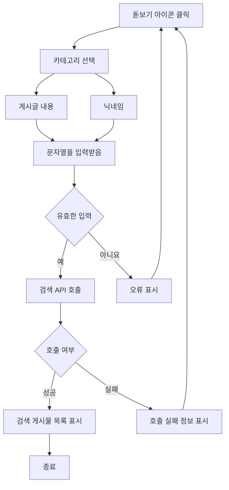
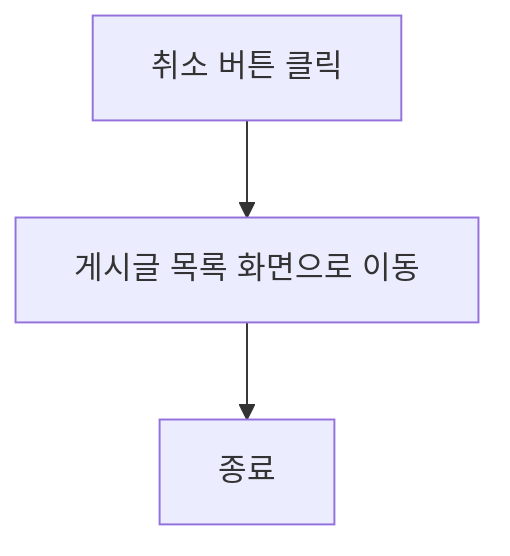
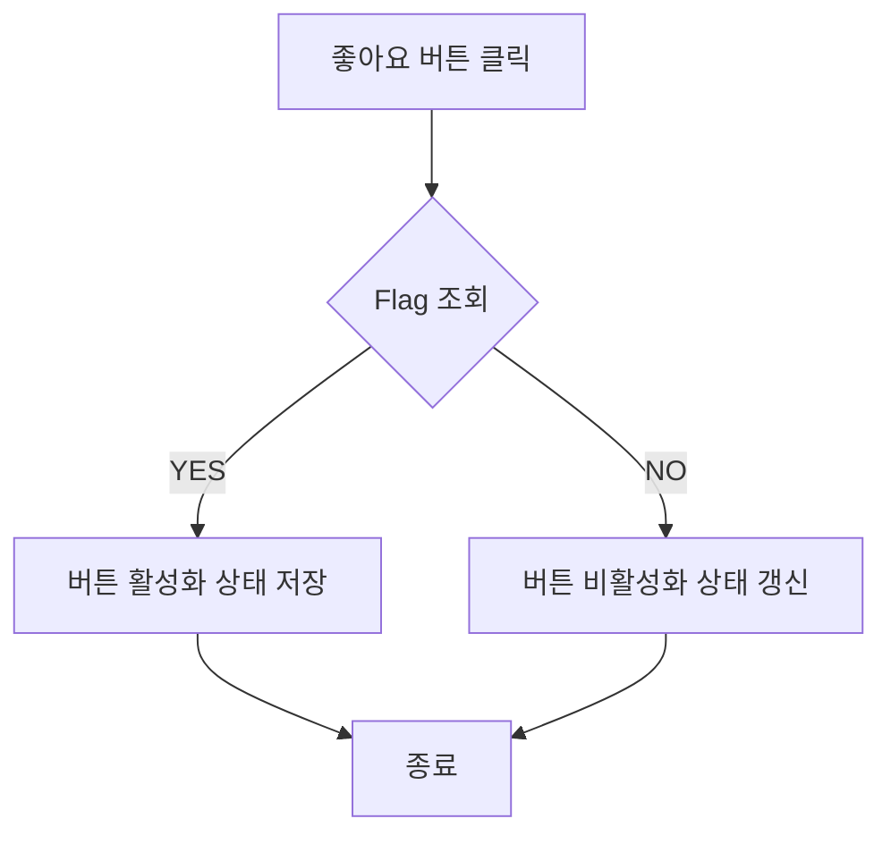
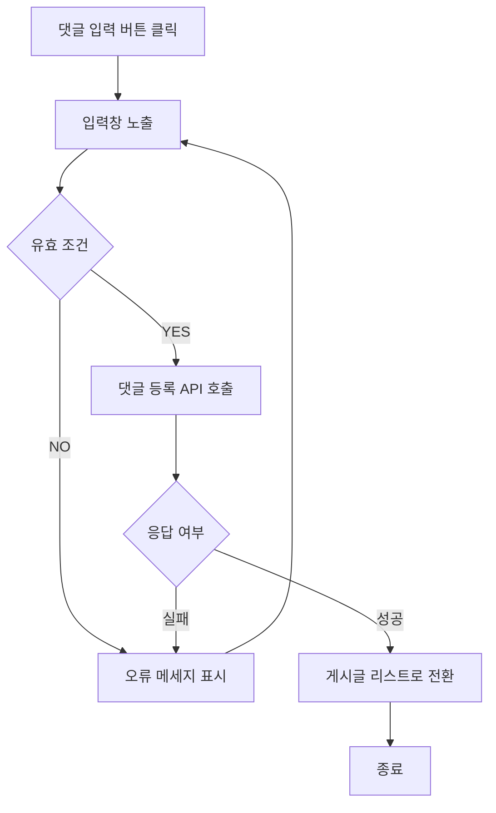
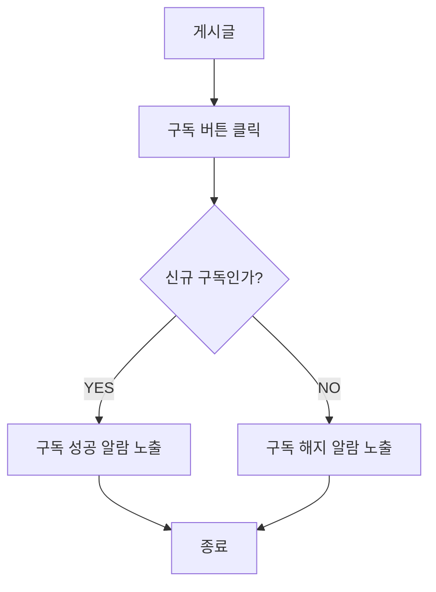
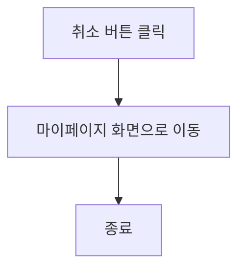

## 글 클릭 사용자 스토리 

### 커뮤니티 이용자로서, 나는 피드에 나타난 글의 세부사항을 확인하고 싶습니다.

#### 기능명 : 게시글 클릭
- 기능 설명 
    - 다른 사용자가 작성한 커뮤니티 피드의 세부내용을 확인 할 수 있다.


#### 사용자 액션

- 게시물 클릭
    - 해당 게시물의 API 호출
    - API 호출 성공 후 해당 게시물 화면 전환
    
    ```mermaid
    flowchart TD
        A[게시물 클릭] -->  B{해당 게시물의 API 호출}
        B -- 성공 -->C[게시물 화면 전환]
        B -- 실패 -->D[오류 표시]
        D-->A
        C-->Z[종료]
    ```

    ---

## 글 작성 사용자 스토리

### 커뮤니티 이용자로서, 나는 피드에 새로운 글을 작성하여 업로드하고 싶습니다.

#### 기능명: 글 작성

- 기능 설명
    - 사용자가 커뮤니티 피드에 글을 작성하여 다른 사용자에게 노출시킬 수 있다.
- 입력 항목
    - 글 본문

#### 사용자 액션

**사진, 동영상 첨부**

- 사진, 동영상 첨부 버튼 클릭
    - 선택된 파일 호출 시도
    - 호출 실패 시 첨부 절차가 취소되며, 사용자에게 오류 정보 알림
    - 호출 성공 시 첨부된 파일 미리보기 표시

    ```mermaid
    flowchart TD
    C[사진, 동영상 첨부 버튼 클릭]
    G[종료]
    C --> C1{첨부 성공}
    C1 -- 성공 --> C3[미리보기 표시] --> G
    C1 -- 실패 --> C2[오류 표시] --> C
    ```

**임시 저장**

- 임시 저장 버튼 클릭
    - 임시 저장 API 호출
    - API 호출 실패 시 임시 저장 절차는 종료되며 사용자에게 호출 실패 정보 알림
    - API 호출 성공 후 이전 페이지로 이동

    ```mermaid
    flowchart TD
    E[임시 저장 버튼 클릭] --> E2[임시 저장 API 호출]
    E2 --> E4{호출 성공}
    E4 -- 성공 --> E1[임시 저장 후 이전 페이지로 이동] --> G[종료]
    E4 -- 실패 --> E3[호출 실패 정보 표시] --> E
    ```

**작성 취소**

- 작성 취소 버튼 클릭
    - 작성된 내용 유무 판별
    - 작성된 내용이 없는 경우 이전 페이지로 이동
    - 작성된 내용이 있는 경우 취소 의사 확인 후 이전 페이지로 이동

    ```mermaid
    flowchart TD
    D[작성 취소 버튼 클릭]
    G[종료]
    D --> D1{작성된 내용 유무 판별}
    D1 -- 있음 --> D2{취소 의사 확인}
    D2 -- 확인 --> D3[이전 페이지로 이동] --> G
    D2 -- 취소 --> D
    D1 -- 없음 --> D3
    ```

**작성 완료**

- 작성 완료 버튼 클릭
    - 작성된 내용 유무 판별
    - 작성된 내용이 없는 경우 사용자에게 해당 사항을 안내
    - 작성된 내용이 있는 경우 업로드 API 호출
    - API 호출 실패 시 업로드 절차는 종료되며 사용자에게 호출 실패 정보 알림
    - API 호출 성공 후 이전 페이지로 이동

    ```mermaid
    F[작성 완료 버튼 클릭]
    G[종료]
    F --> F1{작성된 내용 유무 판별}
    F1 -- 있음 --> F3[업로드 API 호출]
    F3 --> F6{호출 성공}
    F6 -- 성공 --> F5[이전 페이지로 이동] --> G
    F6 -- 실패 --> F4[호출 실패 정보 표시] --> F
    F1 -- 없음 --> F2[안내 표시] --> F
    ```


## 인기 게시글 사용자 스토리

### 나는 최근 다른 사람들의 관심이 많은 게시글을 보고 싶습니다. 그래서 내가 원하는 게시글과 현재 트랜드 확인할 수 있습니다.

#### 기능 명: 인기 많은 게시글

- 기능 설명: 좋아요, 조회수, 댓글 등 사용자가 원하는 것을 기준으로 가장 많은 상위 게시물을 우선적으로 나타낼 수 있다.
- 주요 기능:
    - 좋아요, 조회수, 댓글 순 정렬 기능

#### 사용자 액션: “인기 많은 게시글” 클릭

- 게시글 API  호출
- API 호출 성공 후 게시물 정보 가져옴
- API 호출 실패시 호출 실패 표시
- 게시물 정보 분류
- 좋아요, 조회수, 댓글수 기준 정렬
- 최근 10일 이내 게시글 정렬
- 게시글 목록 출력



## 게시글 검색 사용자 스토리

### 일반 회원으로서, 내가 원하는 조건대로 게시글을 찾고 싶습니다. 따라서 내가 원하는 게시글을 찾을 수 있습니다.

**기능명 :  게시글 검색**

- 기능 설명
    - 일반 회원 및 사업자 회원은 검색 기능을 사용하여 사용자가 원하는 조건에 부합하는 게시글을 찾을 수 있다.
- 주요 기능:
    - 검색 바 제공
    - 제목, 작성자를 키워드로 검색 가능
    - 검색 결과 필터링 (카테고리 및 키워드)
    - 최근 검색 기록 저장
- 입력 항목
    - 게시글 제목 : 문자열, 최대 10글자
    - 닉네임 : 문자열, 최대 6글자
    - *~~패스워드 : 문자열 최대 10글자(유효성 검사 필요)~~*
    - *~~작성일 : 날짜 (yyyy-mm-dd 형식)~~*

**사용자 액션**

검색

- 돋보기 아이콘 클릭/검색 버튼 클릭
    - 게시글 제목/닉네임 카테고리 선택
    - 문자열을 입력받음
    - 해당 카테고리에 입력받은 문자열이 존재하는지 검사
    - 오류 발생시 검색 절차는 종료되며 사용자에게 오류 정보 알림
    - 검사 통과시 검색  API 호출
    - API 호출 성공 후 검색 게시물 목록  표시



---
- 취소 버튼 클릭
    - 게시글 목록 화면으로 전환





    
## 게시글 검색 사용자 스토리
    
### 일반/사업자 회원으로서 광고, 욕설, 비방 등으로 불쾌함을 느껴 게시물 또는 댓글의 작성자를 신고하려 합니다.
    
### 따라서 클린한 글 · 댓글 문화를 만들고자 합니다.
    
**기능명 : 신고 기능**
    
- 기능 설명
    - 사용자가 광고, 욕설, 비방 등으로 인해 불쾌함을 느껴 신고하고 이를 통해 관리자가 관리함으로써 클린한 게시글 및 댓글 문화를 유지할 수 있다.
    - 입력 항목
        - 신고사유 : 선택형 목록(프론트엔드에서 제공)
        - 사유에 따라 추가 정보 : 문자열, 최대 100자
        - 신고 날짜 :  날짜 (yyyy-mm-dd 형식)
    
**사용자 액션**
    
**신고**
    
- 산고 버튼 클릭
    - 사유 카테고리 선택 검사 실행
    - 사유 카테고리 선택 검사 오류 발생시 사용자에게 오류 정보 알림
    - 입력 항목 유효성 검사 실행
    - 유효성 검사 오류 발생시  사용자에게 오류 정보 알림
    - 사유 카테고리 선택 검사 및 유효성 검사 통과시 등록 API 호출
    - API 호출 성공 후 요약 정보 표시
    - 해당 게시글 화면으로 전환
    ```mermaid
    flowchart TD
        A[신고 버튼 클릭] --> B[입력 및 선택 항목 유효성 검사]
        B --> C{유효한 입력}
        C -- 예 --> D[등록 API 호출]
        C -- 아니요 --> E[사용자에게 오류 정보 알림]
        E --> A
        D --> F{API 호출 여부}
        F -- 성공 --> G[요약 정보 표시]
        F -- 실패 --> H[호출 실패 정보 표시]
        H --> A
        G --> I[해당 게시글 화면으로 전환]
        I --> Z[종료]

    ```

    ---
- 취소 버튼 클릭
    - 해당 게시글 화면으로 전환
        
    ```mermaid
    flowchart TD
    A[취소 버튼 클릭] --> B[설정 화면으로 이동]
    B --> Z[종료]
    ```
        
    
## 회원 관리 관리자 스토리
    
### 웹/앱 관리자로서 일반/사업자 계정을 관리하고 싶습니다. 고객 이해, 맞춤형 서비스 제공의 이점을 얻고자 합니다.
    
**기능명 : 회원 관리**
    
- 기능 설명
    - 웹/앱 관리자가 회원들의 계정을 정지 또는 삭제함으로써 계정을 관리 할 수 있다.
    - 입력 항목
        - *회원 닉네임 : 문자열 , 최대 10글자*
        - 제재 사유 : 문자열, 최대 100글자
        - 제재 관리 : 선택형 목록(프론트엔드에서 제공) ~~정지 or 삭제~~
        - *제재 날짜 : (yyyy-mm—dd 형식)*
    
    **사용자 액션**
    
    **관리**
    
    - 관리 버튼 클릭
        - 사유 카테고리 선택 검사 실행
        - 사유 카테고리 선택 검사 오류 발생시 사용자에게 오류 정보 알림
        - 입력 항목 유효성 검사 실행
        - 유효성 검사 오류 발생시  사용자에게 오류 정보 알림
        - 사유 카테고리 선택 검사 및 유효성 검사 통과시 등록 API 호출
        - API 호출 성공 후 요약 정보 표시
        - 해당 설정 화면으로 전환
        
    ```mermaid
    flowchart TD
        A[관리 버튼 클릭] --> B[입력 및 선택 항목 유효성 검사]
        B --> C{유효한 입력}
        C -- 예 --> D[등록 API 호출]
        C -- 아니요 --> E[사용자에게 오류 정보 알림]
        E --> A
        D --> F{API 호출 여부}
        F -- 성공 --> G[요약 정보 표시]
        F -- 실패 --> H[호출 실패 정보 표시]
        H --> A
        G --> I[해당 게시글 화면으로 전환]
        I --> Z[종료]
    ```

    ---
        
    - 취소 버튼 클릭
        - 해당 설정 화면으로 전환    
    ```mermaid
    flowchart TD
        A[취소 버튼 클릭] --> B[설정 화면으로 이동]
        B --> Z[종료]
    ```

## 게시글 반응 사용자 스토리

### 나는 일반 사용자로서, 다른 사용자의 게시물에 반응을 남기고 싶습니다.

#### 기능명: 게시글 반응

- 기능 설명
    - 좋아하는 게시물에 버튼과 간단한 텍스트를 통해 상호작용 한다.
- 입력 항목
    - 사용자/게시물 ID: 고유 식별자
    - Liked flag: Boolean. 현재 좋아요 상태
    - (댓글) 입력된 문자열: 문자열, 최대 300자
    
#### 사용자 액션

**반응 남기기**

- 좋아요 버튼 클릭
    - 사용자 정보와 게시물 ID를 통해 이미 좋아요 한 게시글 감별
    - 아닌 경우 버튼 활성화,  좋아요 한 게시글 상태 참으로 변경
    - 맞는 경우 버튼 비활성화, 좋아요 한 게시글 상태 거짓으로 갱신



**댓글 남기기**
- 댓글 남기기 버튼 클릭
    - 입력창 노출 및 사용자 입력
    - 입력 항목이 유효한지 감별
    - 아닌 경우 오류 메시지 표시 후 입력창으로 돌아감
    - 맞는 경우 댓글 등록 API 호출
    - 댓글 등록 API 호출 성공 시 댓글 리스트로 이동
    - 댓글 등록 API 호출 실패 시 오류 메세지 표기 후 입력창으로 돌아감



## 타 이용자 구독 사용자 스토리

### 나는 일반 사용자이며, 관심 있는 사용자를 구독하여 업로드한 콘텐츠를 받아보고 싶습니다.

#### 기능명: 사용자 구독

- 기능 설명
    - 전환 버튼을 통해 게시물의 사용자를 구독한다. 이미 구독한 사용자인 경우 구독을 해지한다.
- 입력 항목
    - 사용자 ID: 고유 식별자
    - Follow flag: Boolean. 현재 구독 여부
#### 사용자 액션
**구독 버튼 클릭**
- 현재 구독 여부 판별
- 해당하는 조건(구독중인 경우 해지/아닌 경우 성공)의 메세지 노출 후 종료


## 내가 작성한 글 관리 스토리

### 커뮤니티 시스템을 이용하는 회원으로서, 내가 작성한 글을 확인하고 싶습니다. 따라서 내가 작성한 글을 언제든지 확인 할 수 있습니다.

**기능명  : 나의 글 확인**

- **기능 설명**
    - 시스템을 이용하는 회원이 자신이 작성한 글을 언제든지 확인 할 수 있습니다.
    

사용자 액션

- 나의 글 클릭
    - 게시물 API 호출
    - API 호출 성공시 내가 작성한  게시물 분류
    - 분류 후 게시물 표시
    
    ```mermaid
    flowchart TD
        A[나의 글 버튼 클릭] --> B[게시물 API 호출]
        B --> C{호출 성공}
        C -- 성공 -->D[내가 작성한 게시물 분류]
        C -- 실패 -->E[오류 표시]
        E-->A
        D --> F[분류 게시물 표시]
        F --> Z[종료]
    ```

    ---
    

- 취소
    - 마이페이지 화면으로 전환



- ***~~입력 항목~~***
    - *~~글 제목 : 문자열, 최대 10글자~~*
    - *~~글 본문 내용 : 문자열, 최대 100글자~~*
    - *~~첨부 이미지/동영상 : 최대 5분이 넘어가지 않는 동영상~~*

*~~수정~~*

- *~~수정 버튼 클릭~~*
    - *~~입력 항목 유효성 검사 실행~~*
    - *~~유효성 검사 오류 발생 시 수정 절차는 종료되며, 사용자에게 오류 정보 알림~~*
    - *~~유효성 검사 통과시 게시물 등록 API 호출~~*
    - *~~API 호출 성공 후 요약 정보 표시~~*
    - *~~해당 게시글 화면으로 전환~~*

- *~~삭제~~*
    - *~~“정말 삭제하시겠습니까?”를 출력하여 사용자에게 한번 더 확인 받는다.~~*
    - *~~확인 받은 후 삭제 API를 호출~~*
    - *~~API 호출 성공 후 “삭제 되었습니다” 메시지 알림~~*
    - *~~게시글 목록 화면으로 전환~~*

- 회원 정보 관리
    
## 회원 정보 관리 스토리
    
### 앱/웹을 사용하는 회원으로서 나의 정보를 수정하고 싶습니다. 따라서 언제든지 나의 정보를 수정 할 수 있습니다.
    
**기능명 : 회원 정보 관리**
    
- 기능 설명
    - 시스템을 사용하는 회원이 회원 정보 관리를 이용하여 회원 정보를 수정 할 수 있습니다.
    - 입력 항목
        - 프로필 이미지 : 사진/동영상 (프론트엔드에서 제공)
        - 프로필 이름 : 문자열, 최대 10글자(유효성 검사 필요)
        - 프로필 소개 : 문자열, 최대 100글자(유효성 검사 필요)
    
**사용자 액션**
    
관리
    
- 관리 버튼 클릭
    - 기존에 존재하는 계정 API(프로필 사진/닉네임/소개글)를 불러온다.
        
    ```mermaid
    flowchart TD
        A[관리 버튼 클릭] -->  B{계정 API 호출}
        B -- 성공 -->C[계정 수정 화면 이동]
        B -- 실패 -->D[오류 표시]
        D-->A
        C-->Z[종료]
    ```

    ---
        
- 등록 버튼 클릭
    - 입력 항목 유효성 검사 실행
    - 유효성 검사 오류 발생시 등록 절차는 종료되며 사용자에게 오류 정보 알림
    - 유효성 검사 통과시 등록 API 호출
    - API 호출 성공 후 요약 정보 표시
    - 마이페이지 화면으로 전환
    
    ```mermaid
    
    flowchart TD
        A[등록 버튼 클릭] --> B[입력 항목 유효성 검증]
        B{유효한 입력} -- 예 --> C[등록 API 호출]
        B{유효한 입력} -- 아니오 --> D[오류 표시]
        D --> A
        C --> E{호출 성공}
        E -- 성공 --> F[마이페이지 화면 전환]
        E -- 실패 --> H[호출 실패 정보 표시]
        H --> A
        F --> Z[종료]
    ```

    ---
    
- 취소 버튼 클릭
    - 마이페이지 화면으로 전환
    
    ```mermaid
    flowchart TD
    A[취소 버튼 클릭] --> B[마이페이지 화면으로 이동]
    B --> Z[종료]
    ```

## 수영 기록 등록 사용자 스토리

### 나는 일반 사용자로서,  스마트워치의 데이터를 불러오거나 직접 입력하는 방식으로 수영 시간과 영법을 기록 하고 싶습니다.

**기능명: 수영 기록 등록**

- 기능 설명
    - 사용자가 직접 수영 시간과 영법을 입력해 저장한다.
    - 혹은 스마트워치 운동 데이터를 기반으로 수영 시간과 영법을 불러온 뒤 등록한다.
- 입력 항목
    - 사용자 정보: 고유 식별자 (자동 생성)
    - 수영 시간: Number, 시간, 분 단위로 입력
    - 영법: 선택 항목(자유형/배영/접영/평영 등)

**사용자 액션**

**기록 등록**

- 기록 등록 버튼 클릭
    - 스마트워치 연동 가능한 데이터가 있는지 확인
    - 있는 경우, 불러오기 여부 질의
    - (불러오기의 경우) 데이터 연동
    - (직접 입력의 경우) 등록 폼에 직접 수영시간/영법 입력
    - 유효한 입력인 경우, 작성 완료 알림
    - 수영 기록 목록으로 이동
    - 유효하지 않거나, 등록 API 호출 실패한 경우 오류 표시

    ```mermaid
     flowchart TD
    A[등록 버튼 클릭] --> J{연동할 데이터 유무}
    J -- 있음 --> K{불러오기 실행여부}
    K -- 예 --> L[데이터 불러오기] --> C[등록 API 호출]
    K -- 아니오 --> M[사용자 직접 입력]
    J -- 아니오 --> M[사용자 직접 입력]
    M --> B[입력 항목 유효성 검증]
    B -- 유효 --> C[등록 API 호출]
    B -- 유효하지 않음 --> D[오류 메시지 표시] --> M
    C --> E{API 호출 성공?}
    E -- 예 --> F[작성 완료 알림] --> G[수영 기록 목록 화면으로 이동]
    E -- 아니오 --> D[오류 메시지 표시] --> M
    G --> Z[종료]
    ```

## 수영장 등록 사용자 스토리
### 관리자로서 모든 회원의 정보를 확인하고 관리하고 싶습니다.
#### 기능명: 수영장 등록
- 기능 설명
    - 사업자 회원이 직접 수영장을 등록하여 사용자에게 수영장 정보를 제공할 수 있다.
- 입력 항목
    - 운영 요일 및 시간: 선택형 목록 + 문자열
    - 주의사항: 문자열
    - 수업 시간표 및 수업 구성 정보: 테이블 + 문자열
    - 강습료: 문자열
    - 레인 정보(개수, 깊이, 길이): 문자열
#### 사용자 액션
**등록**
- 등록 버튼 클릭
    - 입력 항목 유효성 검사 실행
    - 유효성 검사 오류 발생 시 등록 절차는 종료되며 사용자에게 오류 정보 알림
    - 유효성 검사 통과 시 미리보기 화면 제공 후 등록 의사 확인
    - 의사 확인 후 등록 API 호출
    - API 호출 실패 시 호출 실패 정보 표시
    - API 호출 성공 시 이전 페이지로 이동
    ```mermaid
    flowchart TD
    E[종료]
    A[등록 버튼 클릭] --> B{유효한 입력}
    B -- 예 --> B1[미리보기 화면 제공] --> B5{등록 의사 확인}
    B -- 아니오 --> B2[오류 표시] --> A
    B5 -- 예 --> B4[등록 API 호출] --> B6{호출 성공}
    B5 -- 아니오 --> A
    B6 -- 성공 --> C[이전 페이지로 이동] --> E
    B6 -- 실패 --> B3[호출 실패 정보 표시] --> A
    ```
---
- 취소 버튼 클릭
    - 작성된 내용 유무 판별
    - 작성된 내용이 없는 경우 이전 페이지로 이동
    - 작성된 내용이 있는 경우 취소 의사 확인 후 이전 페이지로 이동
    ```mermaid
    flowchart TD
    D[종료]
    A[취소 버튼 클릭] --> B{작성된 내용 유무 판별}
    B -- 있음 --> B1{취소 의사 확인}
    B1 -- 확인 --> C[이전 페이지로 이동] --> D
    B1 -- 취소 --> A
    B -- 없음 --> C