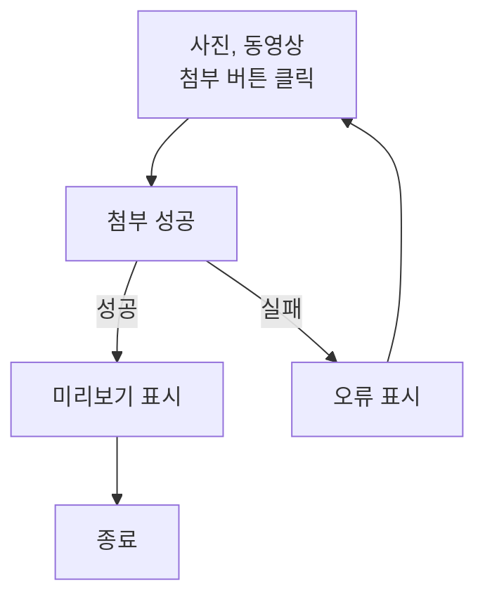
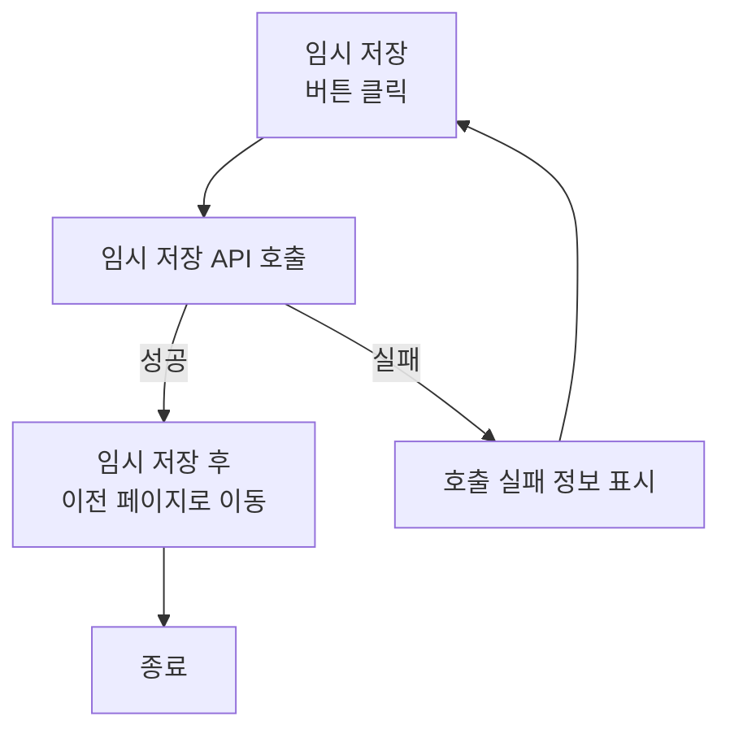
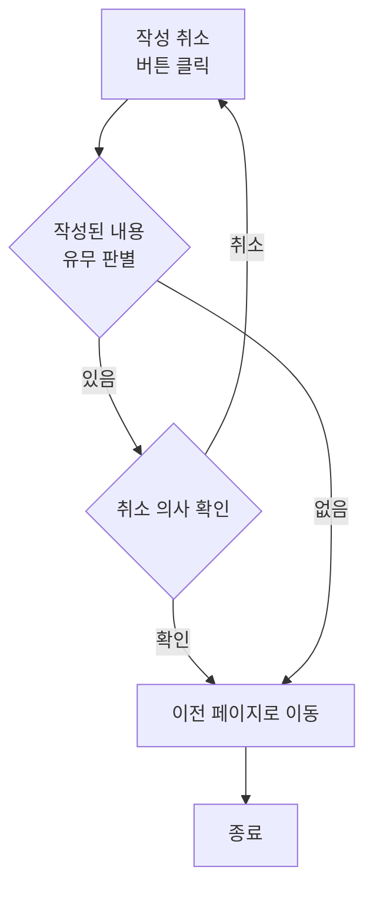
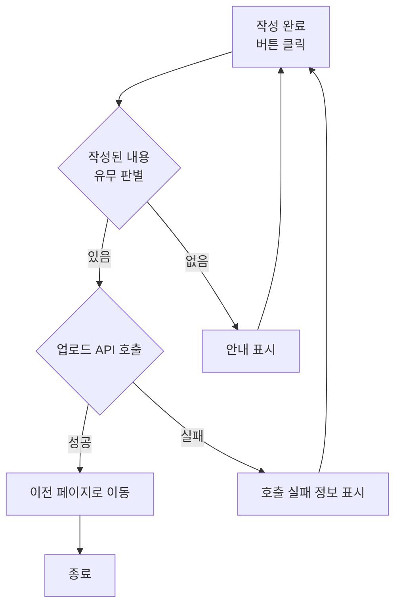

## 글 작성 사용자 스토리

### 커뮤니티 이용자로서, 나는 피드에 새로운 글을 작성하여 업로드하고 싶습니다.

#### 기능명: 글 작성

- 기능 설명
    - 사용자가 커뮤니티 피드에 글을 작성하여 다른 사용자에게 노출시킬 수 있다.
- 입력 항목
    - 글 본문

#### 사용자 액션

**사진, 동영상 첨부**

- 사진, 동영상 첨부 버튼 클릭
    - 선택된 파일 호출 시도
    - 호출 실패 시 첨부 절차가 취소되며, 사용자에게 오류 정보 알림
    - 호출 성공 시 첨부된 파일 미리보기 표시

**임시 저장**

- 임시 저장 버튼 클릭
    - 임시 저장 API 호출
    - API 호출 실패 시 임시 저장 절차는 종료되며 사용자에게 호출 실패 정보 알림
    - API 호출 성공 후 이전 페이지로 이동

**작성 취소**

- 작성 취소 버튼 클릭
    - 작성된 내용 유무 판별
    - 작성된 내용이 없는 경우 이전 페이지로 이동
    - 작성된 내용이 있는 경우 취소 의사 확인 후 이전 페이지로 이동

**작성 완료**

- 작성 완료 버튼 클릭
    - 작성된 내용 유무 판별
    - 작성된 내용이 없는 경우 사용자에게 해당 사항을 안내
    - 작성된 내용이 있는 경우 업로드 API 호출
    - API 호출 실패 시 업로드 절차는 종료되며 사용자에게 호출 실패 정보 알림
    - API 호출 성공 후 이전 페이지로 이동

