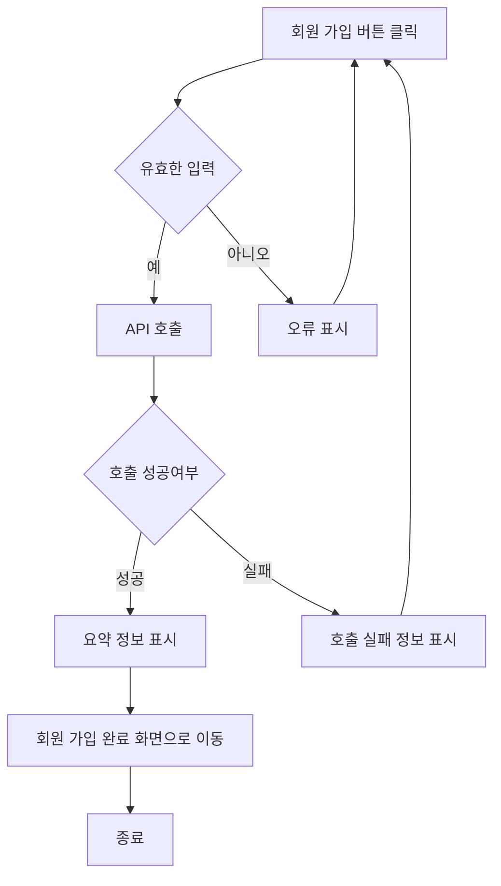
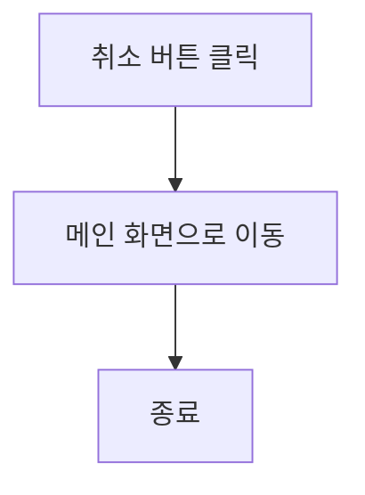
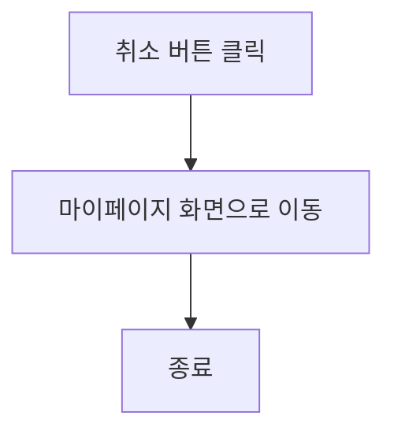
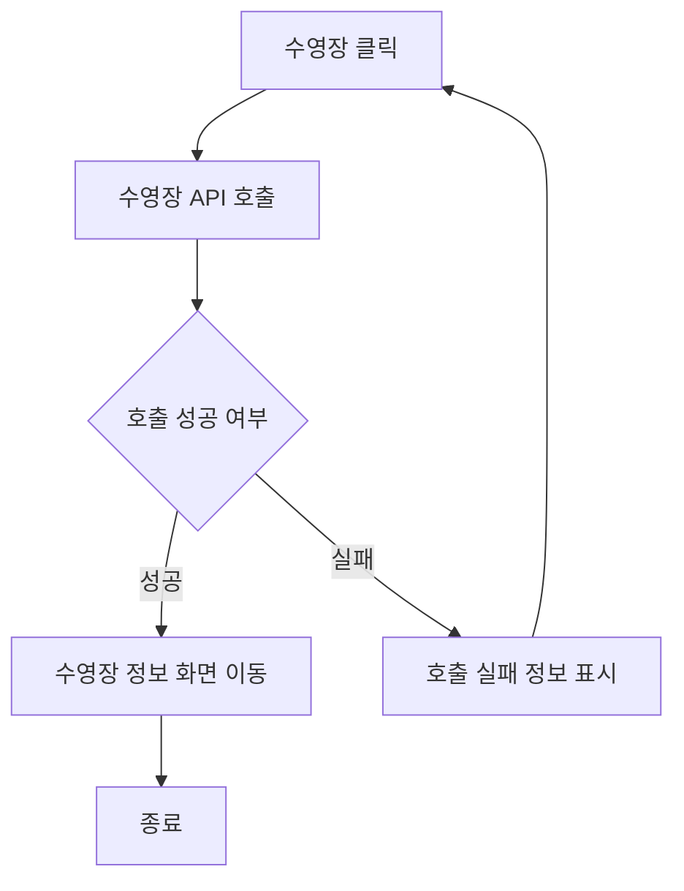
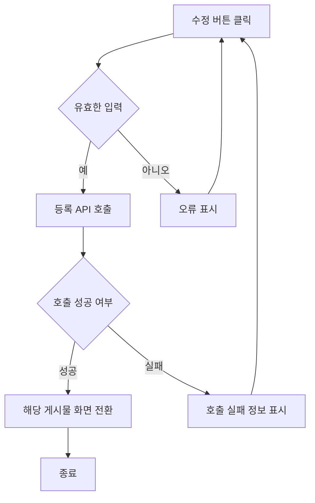
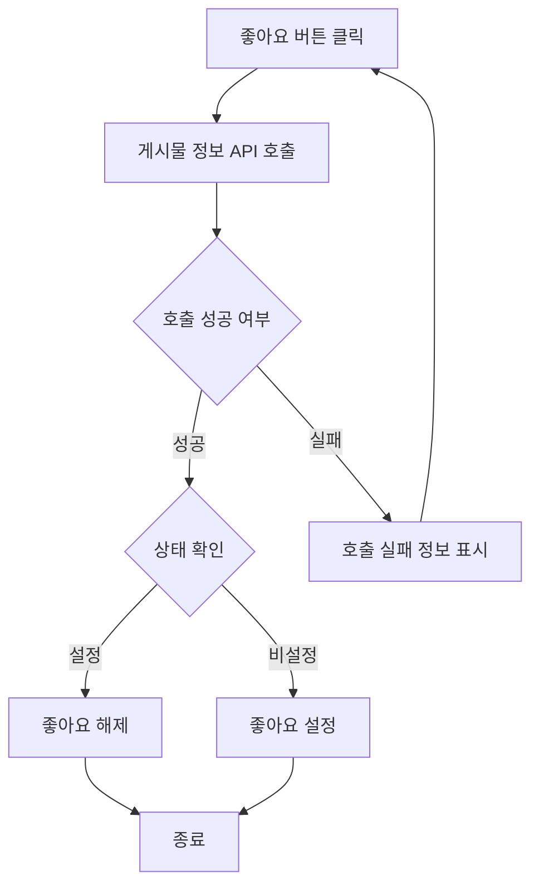
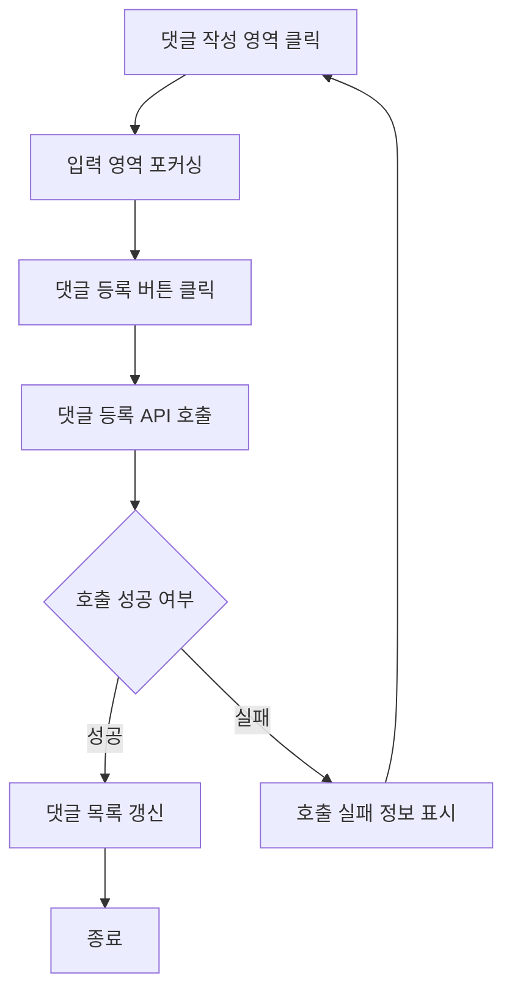

# 기능 정의서

프로젝트 정의서의 사용자 스토리를 기반으로 세부 기능을 구체적으로 정의합니다.

## 회원 가입 사용자 스토리

### 사용자로서 커뮤니티 및 기록 등록 서비스를 이용하기 위해 회원가입을 하고 싶습니다.

#### 기능명: 회원 가입

- 기능 설명
    - 사용자는 회원가입을 통하여 서비스를 이용 할 수 있습니다.
- 입력 항목
    - 회원 ID: 고유 식별자(자동 생성)
    - 이름: 문자열, 최대 50자(유효성 검사 필요)
    - 연락처: 문자열, 최대 15자(유효성 검사 필요)
    - 이메일: 문자열, 최대 50자(유효성 검사 필요)
    - 회원 유형: 선택형 목록(프론트엔드에서 제공)
    - 사업자 번호: 문자열(회원 유형 사업자일 경우)

**사용자 액션**

**회원가입**

- 회원 가입 버튼 클릭
    - 입력 항목 유효성 검사 실행
    - 유효성 검사 오류 발생 시 가입 절차는 종료되며 사용자에게 오류 정보 알림
    - 유효성 검사 통과 시 가입 API 호출
    - API 호출 실패 시 회원가입 절차는 종료되며 사용자에게 호출 실패 정보 알림
    - API 호출 성공 후 요약 정보 표시
    - 회원 가입 완료 화면 전환


---

- 취소 버튼 클릭
    - 메인 화면으로 전환



## 내가 작성한 게시물 확인 스토리

### 커뮤니티를 이용하는 회원으로서, 내가 작성한 게시물을 언제든지 확인 할 수 있습니다.

#### 기능명: 내가 작성한 게시물 확인

- 기능 설명
    - 커뮤니티를 이용하는 회원이 자신이 작성한 게시물을 언제든지 확인 할 수 있습니다.
    

#### 사용자 액션

**게시물 클릭**

- 나의 게시물 클릭
    - 게시물 API 호출
    - API 호출 실패시 오류 메시지 알림 및 절차 종료
    - API 호출 성공시 내가 작성한 게시물 분류
    - 분류 후 게시물 표시
    
    
    ```mermaid
    flowchart TD
        A[나의 게시물 버튼 클릭] --> B[게시물 API 호출]
        B --> C{호출 성공 여부}
        C -- 성공 -->D[내가 작성한 게시물 분류]
        C -- 실패 -->E[오류 표시]
        E-->A
        D --> F[분류 게시물 표시]
        F --> Z[종료]
    ```

    ---
    

- 취소
    - 마이페이지 화면으로 전환



## 회원 정보 관리 스토리
    
### 웹/앱을 사용하는 회원으로서 나의 정보를 언제든지 수정 할 수 있습니다.
    
#### 기능명: 회원 정보 관리
    
- 기능 설명
    - 웹/앱을 사용하는 회원이 회원 정보 관리를 이용하여 회원 정보를 수정 할 수 있습니다.
    - 입력 항목
        - 프로필 이미지: 사진(png,jpg 최대 8MB)
        - 프로필 이름: 문자열, 최대 30글자(유효성 검사 필요)
        - 프로필 소개: 문자열, 최대 100글자(유효성 검사 필요)
    
**사용자 액션**
    
**관리**
    
- 관리 버튼 클릭
    - 기존에 존재하는 계정 API(프로필 사진/닉네임/소개글)를 불러온다.
        
    ```mermaid
    flowchart TD
        A[관리 버튼 클릭] -->  B[계정 API 호출]
        B --> C{호출 성공 여부}
        C -- 성공 -->D[계정 수정 화면 이동]
        C -- 실패 -->E[오류 표시]
        E-->A
        D-->Z[종료]
    ```

    ---
        
- 수정 버튼 클릭
    - 입력 항목 유효성 검사 실행
    - 유효성 검사 오류 발생시 등록 절차는 종료되며 사용자에게 오류 정보 알림
    - 유효성 검사 통과시 수정 API 호출
    - API 호출 성공 후 요약 정보 표시
    - 마이페이지 화면으로 전환
    
    ```mermaid
    
    flowchart TD
        A[수정 버튼 클릭] --> B[입력 항목 유효성 검증]
        B{유효한 입력} -- 예 --> C[수정 API 호출]
        B{유효한 입력} -- 아니오 --> D[오류 표시]
        D --> A
        C --> E{호출 성공 여부}
        E -- 성공 --> F[마이페이지 화면 전환]
        E -- 실패 --> H[호출 실패 정보 표시]
        H --> A
        F --> Z[종료]
    ```

    ---
    
- 취소 버튼 클릭
    - 마이페이지 화면으로 전환
    
    ```mermaid
    flowchart TD
    A[취소 버튼 클릭] --> B[마이페이지 화면으로 이동]
    B --> Z[종료]
    ```


## 회원 관리 관리자 스토리
    
### 웹/앱 관리자로서 일반/사업자 계정을 관리하여 고객 이해, 맞춤형 서비스 제공의 이점을 얻고자 합니다.
    
#### 기능명: 회원 관리
    
- 기능 설명
    - 웹/앱 관리자가 회원들의 계정을 정지 또는 삭제함으로써 계정을 관리 할 수 있다.
    - 입력 항목
        - 회원 닉네임: 문자열 , 최대 10글자(유효성 검사 필요)
        - 제재 사유: 문자열, 최대 100글자(유효성 검사 필요)
        - 제재 유형: 선택형 목록(프론트엔드에서 제공)
        - 제재 날짜: yyyy-mm-dd 형식
    
**사용자 액션**
    
**관리**
    
- 제재 버튼 클릭
    - 입력 및 선택 항목 유효성 검사 실행
    - 유효성 검사 오류 발생시 사용자에게 오류 정보 알림
    - 유효성 검사 통과시 등록 API 호출
    - API 호출 실패 시 제재 절차는 종료되며 사용자에게 호출 실패 정보 알림
    - API 호출 성공 후 화면 목록 화면으로 전환
        
    ```mermaid
    flowchart TD
        A[제재 버튼 클릭] --> C{유효한 입력}
        C -- 예 --> D[등록 API 호출]
        C -- 아니요 --> E[사용자에게 오류 정보 알림]
        E --> A
        D --> F{호출 성공 여부}
        F -- 성공 --> G[회원 목록 화면으로 전환]
        F -- 실패 --> H[호출 실패 정보 표시]
        H --> A
        G --> Z[종료]
    ```

    ---
        
    - 취소 버튼 클릭
        - 해당 회원 목록 화면으로 전환    
    ```mermaid
    flowchart TD
        A[취소 버튼 클릭] --> B[회원 목록 화면으로 이동]
        B --> Z[종료]
    ```

## 회원 정보 확인 스토리

### 웹/앱 관리자로서 사용자를 관리하기 위해 사용자의 정보를 확인하고자 합니다.

#### 기능명: 회원 정보 확인

- 기능 설명
    - 웹/앱 관리자가 비밀번호 수정, 프로필 이미지, 닉네임, 소개글을 확인 할 수 있다.
    
- 입력 항목
    - 회원 비밀번호: 문자열, 최대 10글자(유효성 검사 필요)

**사용자 액션**

**클릭**

- 회원 클릭
    - 회원 정보 API 호출
    - API 호출 실패 시 회원 정보 조회 절차는 종료되며 사용자에게 호출 실패 정보 알림
    - API 호출 성공 후 회원 정보 팝업 화면으로 전환


    ```mermaid
    flowchart TD
        A[회원 클릭] --> B[회원 정보 API 호출]
        B --> C{호출 성공 여부}
        C -- 성공 --> D[회원 정보 팝업 화면으로 전환]
        C -- 실패 --> E[호출 실패 정보 표시]
        E --> A
        D --> Z[종료]
    ```

    ---
        
- 닫기 버튼 클릭
    - 회원 정보 팝업 닫기    
        ```mermaid
        flowchart TD
            A[닫기 버튼 클릭] --> B[회원 정보 팝업 닫힘]
            B --> Z[종료]
        ```

**회원 비밀번호 수정**

- 비밀번호 수정 버튼 클릭
    - 입력 항목  유효성 검사 실행
    - 유효성 검사 오류 발생시 수정 절차는 종료되며 사용자에게 오류 알림
    - 유효성 검사 통과시 비밀번호 수정 API 호출
    - 회원 정보 팝업 화면으로 전환

    ```mermaid
    flowchart TD
        A[비밀번호 수정 버튼 클릭] --> C{유효한 입력}
        C -- 성공 --> D[등록 API 호출]
        C -- 실패 --> E[오류 표시]
        E --> A
        D --> F{호출 성공 여부}
        F -- 성공 --> G[비밀번호 수정 성공 알림]
        F -- 실패 --> H[비밀번호 수정 실패 알림]
        H --> A
        G --> Z[종료]
    ```

    ---
        
    - 취소 버튼 클릭
        - 회원 정보 팝업 화면으로 전환   
    ```mermaid
    flowchart TD
        A[취소 버튼 클릭] --> B[회원 정보 팝업 화면 전환]
        B --> Z[종료]
    ```


## 수영장 등록 사용자 스토리
### 사업자 회원으로서 수영장을 등록하여 다른 사람들에게 노출시키고 싶습니다.
#### 기능명: 수영장 등록
- 기능 설명
    - 사업자 회원이 직접 수영장을 등록하여 사용자에게 수영장 정보를 제공할 수 있다.
- 입력 항목
    - 운영 요일 및 시간: 선택형 목록(프론트엔드에서 제공) + 문자열, 최대 1000자
    - 주의사항: 문자열, 최대 3000자
    - 수업 시간표 및 수업 구성 정보: 표 양식의 문자열, 시간표 항목 별 최대 50자, 구성정보 항복 별 최대 300자
    - 강습료: 문자열, 최대 300자
    - 레인 정보(개수, 깊이, 길이): 문자열, 각 항복별 최대 100자(유효성 검사 필요)

#### 사용자 액션
**등록**
- 등록 버튼 클릭
    - 입력 항목 유효성 검사 실행
    - 유효성 검사 오류 발생 시 등록 절차는 종료되며 사용자에게 오류 정보 알림
    - 유효성 검사 통과 시 미리보기 화면 제공 후 등록 의사 확인
    - 의사 확인 후 등록 API 호출
    - API 호출 실패 시 호출 실패 정보 표시
    - API 호출 성공 시 이전 페이지로 이동
    ```mermaid
    flowchart TD
    E[종료]
    A[등록 버튼 클릭] --> B{유효한 입력}
    B -- 예 --> B1[미리보기 화면 제공] --> B5{등록 의사 확인}
    B -- 아니오 --> B2[오류 표시] --> A
    B5 -- 예 --> B4[등록 API 호출] --> B6{호출 성공 여부}
    B5 -- 아니오 --> A
    B6 -- 성공 --> C[이전 페이지로 이동] --> E
    B6 -- 실패 --> B3[호출 실패 정보 표시] --> A
    ```
---
- 취소 버튼 클릭
    - 작성된 내용 유무 판별
    - 작성된 내용이 없는 경우 이전 페이지로 이동
    - 작성된 내용이 있는 경우 취소 의사 확인 후 이전 페이지로 이동
    ```mermaid
    flowchart TD
    D[종료]
    A[취소 버튼 클릭] --> B{작성된 내용 유무 판별}
    B -- 있음 --> B1{취소 의사 확인}
    B1 -- 확인 --> C[이전 페이지로 이동] --> D
    B1 -- 취소 --> A
    B -- 없음 --> C
    ```

## 수영장 정보 제공 사용자 스토리

### 사용자로서 수영장의 이용 비용 및 운영 시간 등 수영장에 대한 정보를 알고 싶습니다.

#### 기능명: 수영장 정보

- 기능 설명
    - 수영장의 국립 사립 여부, 운영 시간, 강습 및 이용 비용, 락카 유무 등 수영장에 대한 정보를 제공합니다.

**사용자 액션**

**수영장 정보**

- 수영장 클릭
    - 수영장 API 호출
    - API 호출 실패시 수영장 조회 절차는 종료되며 사용자에게 호출 실패 정보 알림
    - API 호출 성공시 수영장 정보 출력




## 수영장 이름 및 지역 검색 사용자 스토리

### 사용자로서 내 주변 수영장과 특정 수영장의 위치를 알고 싶습니다.

#### 기능명: 지도 탐색

- 기능 설명
    - 사용자는 수영장 이름 또는 지역명을 검색하여 수영장의 위치를 알 수 있습니다.
- 입력 항목
    - 수영장 이름: 문자열, 최대 30자
    - 주소: 문자열, 최대 50자

**사용자 액션**

**검색**

- 검색 버튼 클릭
    - 검색 팝업 화면 노출 

    ```mermaid
        flowchart TD

        A[검색 버튼 클릭] --> B[검색 팝업 화면 전환]
        B--> Z[종료]
    ```

    ---


- 검색 완료 버튼 클릭
    - 검색 API 호출
    - API 호출 실패 시 검색 절차는 종료되며 사용자에게 호출 실패 정보 알림
    - API 호출 성공 시 주위 수영장 및 해당 수영장 정보 제공


    ```mermaid
    flowchart TD

    A[검색 버튼 클릭] --> B{유효한 입력}
    B -- 예 --> C
    B -- 아니요 -->A
    C[수영장 검색 API 호출] --> D{호출 성공 여부}
    D -- 성공 --> E[검색 결과 출력]
    D -- 실패 -->F[오류 표시]
    F --> A
    E --> Z[종료]
    ```

    ---

- 취소 버튼 클릭
    - 검색 팝업 닫힘   
    ```mermaid
    flowchart TD
        A[취소 버튼 클릭] --> B[검색 팝업 닫힘]
        B --> Z[종료]
    ```

## 게시물 목록 사용자 스토리 

### 커뮤니티 이용자로서 다른 회원들의 게시물을 보고 싶습니다.

#### 기능명: 게시물 목록

- 기능 설명
    - 작성되어 있는 게시물들을 최신 순으로 확인 할 수 있다.

#### 사용자 액션

**게시판 보기**

- 전체 게시물 버튼 클릭
    - 게시물 API 호출
    - API 호출 실패시 게시물 조회 절차는 종료되며 사용자에게 호출 실패 정보 알림
    - API 호출 성공 후 게시물 정보 가져옴
    - 게시물 작성 시간을 기준으로 내림차순 정렬

     ```mermaid
        flowchart TD
        A[전체 게시물 버튼 클릭] --> B[게시물 API 호출]
        B --> C{호출여부}
        C -- 성공 --> D[게시물 정보 가져옴]
        C -- 실패 --> E[호출 실패 정보 표시]
        E --> A
        D --> F[게시물 정렬]
        F --> G[게시물 출력]
        G --> Z[종료]
    ```

- 인기 게시물 버튼 클릭
    - 게시물 API 호출
    - API 호출 실패시 게시물 조회 절차는 종료되며 사용자에게 호출 실패 정보 알림
    - API 호출 성공 후 게시물 정보 가져옴
    - 최근 10일 이내 게시물 분류
    - 게시물 좋아요 내림차순 
    - 게시물 목록 출력

    ```mermaid
    flowchart TD
    A[인기 게시물 버튼 클릭] --> B[게시물 API 호출]
    B --> C{호출여부}
    C -- 성공 --> D[게시물 정보 가져옴]
    C -- 실패 --> E[호출 실패 정보 표시]
    E --> A
    D --> F[게시물 분류]
    F --> G[10일 이내 게시물 정렬]
    G --> H[좋아요 기준 정렬]
    H --> I[게시물 목록 출력]
    I --> Z[종료]
    ```


## 게시물 클릭 사용자 스토리 

### 커뮤니티 사용자로서, 게시물 목록에서 관심있는 글의 세부사항을 확인하고 싶습니다.

#### 기능명: 게시물 클릭

- 기능 설명 
    - 다른 사용자가 작성한 커뮤니티 게시물의 세부내용을 확인 할 수 있다.


#### 사용자 액션

- 게시물 클릭
    - 게시물의 API 호출
    - API 호출 실패 시 게시물 조회 절차는 종료되며 사용자에게 호출 실패 정보 알림
    - API 호출 성공 후 게시물 상세 화면 전환
    
    ```mermaid
    flowchart TD
        A[게시물 클릭] --> B{게시물의 API 호출}
        B --> C{호출 성공 여부}
        C -- 성공 -->D[게시물 상세 화면 전환]
        C -- 실패 -->E[오류 표시]
        E-->A
        D-->Z[종료]
    ```

## 게시물 작성 사용자 스토리

### 커뮤니티 이용자로서, 게시물 목록에 새로운 글을 작성하여 업로드하고 싶습니다.

#### 기능명: 게시물 작성

- 기능 설명
    - 사용자가 커뮤니티 게시물 목록에 글을 작성하여 다른 사용자에게 노출시킬 수 있다.
- 입력 항목
    - 게시물 본문 사진/동영상 첨부: 이미지(최대 8MB), 동영상(최대 100MB)(유효성 검사 필요)
    - 게시물 본문 글: 문자열, 최대 2000자

#### 사용자 액션

**게시물 작성**


- 사진, 동영상 첨부 버튼 클릭
    - 선택된 파일 호출 시도
    - 파일 호출 실패 시 첨부 절차가 취소되며, 사용자에게 오류 정보 알림
    - 파일 호출 성공 시 첨부된 파일 미리보기 표시

    ```mermaid
    flowchart TD
    C[사진, 동영상 첨부 버튼 클릭]
    G[종료]
    C --> C1{첨부 여부}
    C1 -- 성공 --> C3[미리보기 표시] --> G
    C1 -- 실패 --> C2[오류 표시] --> C
    ```
    ---

- 임시 저장 버튼 클릭
    - 임시 저장 API 호출
    - API 호출 실패 시 임시 저장 절차는 종료되며 사용자에게 호출 실패 정보 알림
    - API 호출 성공 후 이전 페이지로 이동

    ```mermaid
    flowchart TD
    E[임시 저장 버튼 클릭] --> E2[임시 저장 API 호출]
    E2 --> E4{호출 성공 여부}
    E4 -- 성공 --> E1[임시 저장 후 이전 페이지로 이동] --> G[종료]
    E4 -- 실패 --> E3[호출 실패 정보 표시] --> E
    ```

    ---

- 작성 취소 버튼 클릭
    - 작성된 내용 유무 판별
    - 작성된 내용이 없는 경우 이전 페이지로 이동
    - 작성된 내용이 있는 경우 취소 의사 확인 후 이전 페이지로 이동

    ```mermaid
    flowchart TD
    D[작성 취소 버튼 클릭]
    G[종료]
    D --> D1{작성된 내용 유무 판별}
    D1 -- 있음 --> D2{취소 의사 확인}
    D2 -- 확인 --> D3[이전 페이지로 이동] --> G
    D2 -- 취소 --> D
    D1 -- 없음 --> D3
    ```
---
- 작성 완료 버튼 클릭
    - 작성된 내용 유무 판별
    - 작성된 내용이 없는 경우 사용자에게 해당 사항을 안내
    - 작성된 내용이 있는 경우 게시물 업로드 API 호출
    - API 호출 실패 시 업로드 절차는 종료되며 사용자에게 호출 실패 정보 알림
    - API 호출 성공 후 이전 페이지로 이동

    ```mermaid
    flowchart TD
    F[작성 완료 버튼 클릭]
    G[종료]
    F --> F1{작성된 내용 유무 판별}
    F1 -- 있음 --> F3[게시물 업로드 API 호출]
    F3 --> F6{호출 성공 여부}
    F6 -- 성공 --> F5[이전 페이지로 이동] --> G
    F6 -- 실패 --> F4[호출 실패 정보 표시] --> F
    F1 -- 없음 --> F2[안내 표시] --> F
    ```


## 게시물 수정 사용자 스토리

### 커뮤니티 이용자로서, 내가 올린 게시물을 언제든지 수정 할 수 있습니다. 

#### 기능명: 게시물 수정

- 기능 설명
    - 사용자가 커뮤니티에 작성한 본인의 게시물을 수정 할 수 있다.

- 입력 항목
    - 게시물 본문 사진/동영상 첨부: 이미지(최대 8MB), 동영상(최대 100MB)(유효성 검사 필요)
    - 게시물 본문 글: 문자열, 최대 2000자

#### 사용자 액션

**수정**

- 수정 버튼 클릭
    - 입력 항목 유효성 검사 실행
    - 유효성 검사 오류 발생 시 수정 절차는 종료되며, 사용자에게 오류 정보 알림
    - 유효성 검사 통과시 게시물 등록 API 호출
    - API 호출 실패 시 수정 절차는 종료되며, 사용자에게 호출 실패 정보 알림
    - API 호출 성공 후 요약 정보 표시
    - 해당 게시물 화면으로 전환



---

취소

- 취소 버튼 클릭
    - 게시물 목록 화면으로 전환
    
    ```mermaid
    flowchart TD
    A[취소 버튼 클릭] --> B[해당 게시물 화면으로 이동]
    B --> Z[종료]
    ```

## 게시물 삭제 사용자 스토리
    
### 커뮤니티 이용자로서, 내가 올린 게시물을 언제든지 삭제 할 수 있습니다. 

    
#### 기능명: 게시물 삭제
    
- 기능 설명
    - 사용자가 커뮤니티에 작성한 본인의 게시물을 삭제 할 수 있다.
    
#### 사용자 액션
    
**삭제**
    
- 삭제 버튼 클릭
    - 삭제 API 호출
    - API 호출 실패 시 삭제 절차는 종료되며 사용자에게 호출 실패 정보 알림
    - API 호출 성공 후 “게시물이 삭제 되었습니다” 알림 표시
    - 게시물 목록 화면으로 전환
        
    ```mermaid
    flowchart TD
        A[삭제 버튼 클릭] --> B{삭제 여부}
        B -- 예 --> C[삭제 API 호출]
        B -- 아니오 --> D[오류 표시]
        C --> E{호출 성공 여부}
        D --> A
        E -- 성공 --> F[삭제 알림]
        E -- 실패 --> G[호출 실패 정보 표시]
        G -->A
        F --> H[게시물 목록 화면 이동]
        H --> Z[종료]
    ```

    ---

- 취소 버튼 클릭
    - 해당 게시물 화면으로 전환
     ```mermaid
    flowchart TD
        A[취소 버튼 클릭] --> B[해당 게시물 화면으로 이동]
        B --> Z[종료]

## 게시물 검색 사용자 스토리

### 커뮤니티 이용자로서, 원하는 조건대로 게시물을 찾고 싶습니다. 

#### 기능명: 게시물 검색

- 기능 설명
    - 사용자는 검색 기능을 사용하여 원하는 조건에 부합하는 게시물을 찾을 수 있다.

- 입력 항목
    - 검색어: 문자열, 최대 30자

#### 사용자 액션

**검색**


- 검색 버튼 클릭
    - 검색 팝업 화면 노출 

    ```mermaid
        flowchart TD

        A[검색 버튼 클릭] --> B[검색 팝업 화면 전환]
        B--> Z[종료]
    ```

    ---


- 검색 완료 버튼 클릭
    - 검색 API 호출
    - API 호출 실패 시 검색 절차는 종료되며 사용자에게 호출 실패 정보 알림
    - API 호출 성공 시 검색 결과 표시 화면으로 전환


    ```mermaid
    flowchart TD

    A[검색 버튼 클릭] --> B{유효한 입력}
    B -- 예 --> C
    B -- 아니요 -->A
    C[게시물 검색 API 호출] --> D{호출 성공 여부}
    D -- 성공 --> E[검색 결과 표시 화면 전환]
    D -- 실패 -->F[호출 실패 정보 표시]
    F --> A
    E --> Z[종료]
    ```

    ---

- 취소 버튼 클릭
    - 검색 팝업 닫힘   
    ```mermaid
    flowchart TD
        A[취소 버튼 클릭] --> B[검색 결과 표시 화면 전환]
        B --> Z[종료]
    ```

    ---

    
## 신고 사용자 스토리

### 커뮤니티 이용자로서 광고, 욕설, 비방 등으로 불쾌감을 유발하는 게시물 또는 댓글을 신고하려 합니다
    
#### 기능명: 신고 기능
    
- 기능 설명
    - 사용자가 광고, 욕설, 비방 등으로 인해 불쾌함을 느껴 신고하고 이를 통해 관리자가 관리함으로써 클린한 게시물 및 댓글 문화를 유지할 수 있다.
    - 입력 항목
        - 신고사유: 선택형 목록(프론트엔드에서 제공,유효성 검사 필요)
        - 상세 사유: 문자열, 최대 100자
    
**사용자 액션**
    
**신고**
    
- 신고 버튼 클릭
    - 사유 카테고리 선택 검사 실행
    - 사유 카테고리 선택 검사 오류 발생시 사용자에게 오류 정보 알림
    - 사유 카테고리 선택 검사 및 유효성 검사 통과시 신고 등록 API 호출
    - API 호출 실패시 신고 절차는 종료되며 사용자에게 호출 실패 정보 알림 
    - API 호출 성공 후 신고 팝업 닫힘

    ```mermaid
    flowchart TD
        A[신고 버튼 클릭] --> B[신고 팝업 열림]
        B --> C{유효한 입력}
        C -- 예 --> D[신고 등록 API 호출]
        C -- 아니요 --> E[오류 표시]
        E --> A
        D --> F{호출 성공 여부}
        F -- 성공 --> G[신고 완료 알림] 
        F -- 실패 --> H[호출 실패 정보 표시]
        H --> A
        G --> Z[종료]
    ```

    ---
- 취소 버튼 클릭
    - 신고 팝업 닫힘
        
    ```mermaid
    flowchart TD
    A[취소 버튼 클릭] --> B[신고 팝업 닫힘]
    B --> Z[종료]
    ```


## 게시물 반응 사용자 스토리

### 커뮤니티 이용자로서, 관심있는 게시물에 반응을 남기고 싶습니다.

#### 기능명: 게시물 반응

- 기능 설명
    - 관심있는 게시물에 좋아요 버튼과 댓글을 통해 상호작용 한다.
- 입력 항목
    - 댓글: 문자열, 최대 300자
    
#### 사용자 액션

**반응 남기기**

- 좋아요 버튼 클릭
    - 클릭시 게시물 정보 API 호출
    - API 호출 실패 시 사용자에게 호출 실패 정보 알림
    - API 호출 성공시 좋아요 상태 변경




**댓글 남기기**
- (모바일)댓글 작성 영역 클릭
    - 댓글 작성 영역을 디스플레이 상단으로 스크롤


- 등록 버튼 클릭
    - 댓글 등록 API 호출 
    - API 호출 실패 시 댓글 등록 절차는 종료되며 사용자에게 호출 실패 정보 알림    
    - API 호출 성공 후 댓글 목록 갱신




## 타 이용자 구독 사용자 스토리

### 커뮤니티 이용자로서, 관심 있는 회원을 구독하여 게시물을 모아보거나 알림을 받아보고 싶습니다.

#### 기능명: 사용자 구독

- 기능 설명
    - 전환 버튼을 통해 게시물의 사용자를 구독한다. 이미 구독한 사용자인 경우 구독을 해지한다.

#### 사용자 액션

**구독**

- 구독 버튼 클릭
    - 해당하는 조건(구독중인 경우 해지/아닌 경우 성공)의 메세지 노출 후 종료

    ```mermaid
    flowchart TD
        A[구독 버튼 클릭] --> B[구독 API 호출]
        B --> C{호출 성공 여부}
        C -- 성공 --> D[신규 구독 여부 판단]
        C -- 실패 --> E[호출 실패 정보 표시]
        E --> A
        D -- 예 --> F[구독 해제 알림]
        D -- 아니요 --> G[구독 추가 알림]
        F --> Z[종료]
        G --> Z[종료]

    ```


## 수영 기록 등록 회원 스토리

### 회원으로서, 나의 수영시간과 영법을 기록하고 싶습니다.

#### 기능명: 수영 기록 등록

- 기능 설명
    - 사용자가 직접 수영 시간과 영법을 입력해 저장한다.
    - 혹은 스마트워치 운동 데이터를 기반으로 수영 시간과 영법을 불러온 뒤 등록한다.
- 입력 항목
    - 수영 시간: Number, 시간, 분, 초 단위로 입력(유효성 검사 필요)
    - 영법: 선택형 목록(프론트엔드에서 제공)

**사용자 액션**

**주변 기기 연동**
- 주변 기기 연동 버튼 클릭
    - 스마트워치 연동 API 호출
    - API 호출 실패시 연동 절차는 종료되며 사용자에게 호출 실패 정보 알림  
    - API 호출 성공시 스마트워치 연동
    - 데이터 연동

    ```mermaid
        flowchart TD
        A[주변 기기 연동 버튼 클릭] --> B[스마트워치 연동 API 호출]
        B --> C{호출 성공 여부}
        C -- 성공 --> D[스마트워치 연동]
        C -- 실패 --> E[호출 실패 정보 표시]
        E --> A
        D --> Z[종료]
    ```


**기록 등록**

- 기록 등록 버튼 클릭
    - 등록 폼에 직접 수영시간/영법 입력
    - 입력 항목 유효성 검사 실행
    - 유효성 검사 오류 발생시 기록 등록 절차는 종료되며 사용자에게 오류 정보 알림
    - 유효성 검사 통과시 기록 등록 API 호출
    - API 호출 실패시 등록 절차는 종료되며 사용자에게 호출 실패 정보 알림  
    - API 호출 성공 후 수영 기록 목록으로 이동


    ```mermaid
        flowchart TD
            A[등록 버튼 클릭] --> B[입력 항목 유효성 검증]
            B{유효한 입력} -- 예 --> C[등록 API 호출]
            B{유효한 입력} -- 아니오 --> D[오류 표시]
            D --> A
            C --> E{호출 성공}
            E -- 성공 --> F[수영 기록 목록으로 이동]
            E -- 실패 --> H[호출 실패 정보 표시]
            H --> A
            F --> Z[종료]
    ```

## 내 수영 기록 공유 사용자 스토리

### 웹/앱을 사용하는 회원으로서, 다른 회원에게 수영 기록을 공유하고 기록을 통해 순위를 비교할 수 있습니다.

#### 기능명: 기록 공유

- 기능 설명
    - 자신의 수영 기록을 시스템을 통해 다른 회원과 공유할 수 있다.
    - 공유된 기록을 다른 회원과 공유 할 수 있으며 순위를 통해 경쟁할 수 있다.
- 입력 항목
    - 공유 대상: 선택형 목록(프론트엔드 제공)

**사용자 액션**

**내 수영 기록 공유**

- 공유 버튼 클릭
    - 공유 대상 선택
    - 공유 API 호출 
    - API 호출 실패시 기록 공유 절차는 종료되며 사용자에게 호출 실패 정보 알림  
    - API 호출 성공 후 공유 완료 알림

    ```mermaid
    flowchart TD
    A[공유 버튼 클릭] --> B[공유 대상 선택]
    B --> C[공유 API 호출]
    C --> D{호출 성공 여부}
    D -- 성공 --> E[공유 완료 알림]
    D -- 실패 --> F[호출 실패 정보 표시]
    F --> A
    E --> Z[종료]
    ```