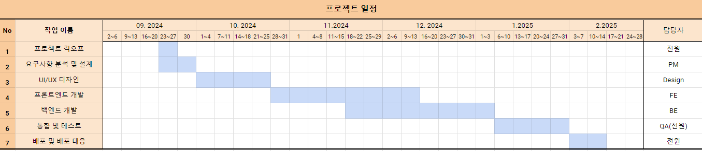

# 수영일기 프로젝트 정의서

## 개요

### 프로젝트명

수영일기

### 목표

- 수영 인구 증가에 따라 상대적인 정보 부족 문제 해결
- 직관적인 인터페이스로 기존의 복잡한 수영장 탐색 과정 간소화
- 안전하고 신뢰성 높은 커뮤니티 제공 및 고령자와 장애인을 고려한 접근성 고려

### 사용자 정의

- 취미나 운동으로 수영을 즐기려는 일반 사용자
- 운영중인 수영장이나 용품을 홍보하려는 자영업자, 수영 코칭이 필요한 고객을 찾는 강사

## 요구사항

#요구사항 정의서

## 시스템 아키텍처

### 아키텍처 개요

- 프론트엔드: JavaScript (React.js)
- 백엔드: Node.js (Express.js)
- 데이터베이스:  MongoDB(w. Mongoose)

### 모듈 구성

- 프론트엔드: 사용자 인터페이스, 데이터 시각화, API 연동
- 백엔드: RESTful API, 비즈니스 로직, 데이터베이스 연동
- 데이터베이스: 회원 정보, 수영장 정보, 게시물 정보, 운동 기록 정보

### 데이터베이스 설계

- 데이터베이스 설계서 참고
- 데이터베이스 설계
    
    ```mermaid
    %%{ init : { "theme" : "default" } }%%
    erDiagram
        users {
            integer user_id PK
            varchar profile_name
            varchar phone_number
            varchar user_email
            varchar user_password
            varchar user_type
            varchar business_number
            timestamp created_at
        }
    
        user_profiles {
            integer user_id PK
            varchar profile_image
            varchar profile_name
            varchar profile_description
        }
    
        user_management {
            integer user_id PK
            varchar profile_name
            varchar sanction_reason
            varchar sanction_type
            date sanction_date
        }
    
        reports {
            integer user_id PK
            integer profile_name
            integer post_id PK
            varchar report_reason
            varchar detailed_reason
        }
    
        swimming_pools {
            integer pool_id PK
            varchar pool_name PK
            varchar operating_days_hours
            varchar precautions
            text class_schedule_info
            varchar lesson_fee
            varchar lane_info
        }
    
        posts {
            integer post_id PK
            integer user_id PK
            boolean like
            varchar post_text
            varchar post_image
            varchar post_video
            timestamp created_at
            timestamp updated_at
        }
    
        comments {
            integer post_id PK
            integer user_id PK
            varchar comment_text
            timestamp created_at
            timestamp updated_at
        }
    
        %% Relationships
        users ||--o{ user_profiles : has
        users ||--o{ user_management : manages
        users ||--o{ reports : reports
        users ||--o{ posts : creates
        users ||--o{ comments : comments_on
        posts ||--o{ comments : contains
        posts ||--o{ reports : has_reported
    
        swimming_pools ||--o{ posts : contains
        users ||--o{ swimming_pools : manages
       
    ```

    ---
    
- 컴포넌트 관계도
    
    ```mermaid
    %%{ init : { "theme" : "default" } }%%
    graph LR
        %% 사용자 인터페이스
        A[사용자 인터페이스]:::ui -->|사용자 정보 요청| B[API 서버]:::api
        A -->|게시물 작성| B
        A -->|댓글 작성| B
        A -->|신고| B
        A -->|수영장 정보 조회| B
    
        %% API 서버와 데이터베이스
        B -->|사용자 데이터| C[사용자 데이터베이스]:::db
        B -->|프로필 데이터| D[프로필 데이터베이스]:::db
        B -->|게시물 데이터| E[게시물 데이터베이스]:::db
        B -->|댓글 데이터| F[댓글 데이터베이스]:::db
        B -->|신고 데이터| G[신고 데이터베이스]:::db
        B -->|수영장 데이터| H[수영장 데이터베이스]:::db
    
        %% 관리자 대시보드
        I[관리자 대시보드]:::ui -->|관리 요청| B
        B -->|관리 응답| I
    
        %% 스타일 정의
        classDef ui fill:#f9f,stroke:#333,stroke-width:2px;
        classDef api fill:#bbf,stroke:#333,stroke-width:2px;
        classDef db fill:#ffb,stroke:#333,stroke-width:2px;
        classDef entity fill:#bfb,stroke:#333,stroke-width:2px;
    ```
    

### 인터페이스 설계

- 프론트엔드-백엔드 인터페이스: RESTful API를 사용한 데이터 통신
- 백엔드-데이터베이스 인터페이스: Spring Boot를 사용한 MySQL 연동

## 설계 상세

### 사용자 스토리

**사용자 등록**

- **회원 가입**
    - 사용자로서 커뮤니티 및 기록 등록 서비스를 이용하기 위해 회원 가입을 하고 싶습니다.

**회원 관리**

- **내가 작성한 게시물 확인**
    - 커뮤니티를 이용하는 회원으로서 내가 작성한 게시물을 언제든지 확인 할 수 있습니다.
- **회원 정보 관리**
    - 웹/앱을 사용하는 회원으로서 나의 정보를 언제든지 수정 할 수 있습니다.
- **회원 관리 관리자**
    - 웹/앱 관리자로서 일반/사업자 계정을 관리하여 고객 이해 맞춤형 서비스 제공의 이점을 얻고자 합니다.
- **회원 정보 확인**
    - 웹/앱 관리자로서 사용자를 관리하기 위해 사용자의 정보를 확인하고자 합니다.

**수영장 관리**

- **수영장 등록**
    - 사업자 회원으로서 수영장을 등록하여 다른 사람들에게 노출 시키고 싶습니다.

**수영장 탐색**

- **수영장 정보 제공**
    - 사용자로서 수영장의 이용 비용 및 운영 시간 등 수영장에 대한 정보를 알고 싶습니다.
- **수영장 이름 및 지역 검색**
    - 사용자로서 내 주변 수영장과 특정 수영장의 위치를 알고 싶습니다.

**커뮤니티**

- **게시물 목록**
    - 커뮤니티 이용자로서 다른 회원들의 게시물을 보고 싶습니다.
- **게시물 클릭**
    - 커뮤니티 이용자로서 게시물 목록에서 관심 있는 글의 세부 사항을 확인하고 싶습니다.
- **게시물 작성**
    - 커뮤니티 이용자로서 게시물 목록에 새로운 글을 작성하여 업로드하고 싶습니다.
- **게시물 수정**
    - 커뮤니티 이용자로서 내가 올린 게시물을 언제든지 수정 할 수 있습니다.
- **게시물 삭제**
    - 커뮤니티 이용자로서 내가 올린 게시물을 언제든지 삭제 할 수 있습니다.
- **게시물 검색**
    - 커뮤니티 이용자로서 원하는 조건대로 게시물을 찾고 싶습니다.
- **신고**
    - 커뮤니티 이용자로서 광고, 욕설, 비방 등으로 불쾌감을 유발하는 게시물 또는 댓글을 신고하려 합니다.
- **게시물 반응**
    - 커뮤니티 이용자로서 관심 있는 게시물에 반응을 남기고 싶습니다.
- **타 이용자 구독**
    - 커뮤니티 이용자로서 관심 있는 회원을 구독하여 게시물을 모아보거나 알림을 받아보고 싶습니다.

**수영 기록**

- **수영 기록 등록**
    - 웹/앱을 사용하는 회원으로서 나의 수영 시간과 영법을 기록하고 싶습니다.
- **내 수영 기록 공유**
    - 웹/앱을 사용하는 회원으로서 다른 회원에게 수영 기록을 공유하고, 기록을 통해 순위를 비교 할 수 있습니다.

## 구현 계획

### 개발 환경

- 프론트엔드:
    - React.js : 사용자 인터페이스 개발
    - HTML, CSS, JavaScript : 웹 페이지 구조, 스타일, 동작 구현
- 백엔드:
    - Node.js : 서버 사이드 로직을 처리
    - Spring Boot: 자바 기반의 웹 애플리케이션 및 RESTful API 구축
- 데이터베이스:
    - MySQL : 관계형 데이터베이스로 데이터 저장 및 관리
- 도구:
    - Visual Studio Code : 코드 편집 및 개발
    - Git : 버전 관리
    - IntelliJ IDEA: 자바 및 Spring Boot 개발을 위한 IDE

### 개발 일정

- 요구사항 분석 및 설계 - 2주
- UI/UX 디자인 - 4주
- 백엔드 개발 - 8주
- 프론트엔드 개발 - 8주
- 통합 및 테스트 - 4주
- 배포 및 유지보수 - 지속적



 

### 자원 계획

- PM: 1명
- UI/UX 디자이너: 2명
- 프론트엔드 개발자: 3명
- 백엔드 개발자: 2명
- DBA: 1명
- QA 엔지니어: 3명

### 테스트 계획

**테스트 전략**

유닛 테스트, 통합 테스트, 시스템 테스트, 사용자 수용 테스트

**테스트 시나리오**

기능별 TC(테스트 케이스) 정의서 참고

**품질 보증**

코드 리뷰, 자동화 테스트(E2E), 성능 테스트

### 배포 계획

**배포 전략**

스테이징 환경에서 충분한 테스트 후 프로덕션 환경에 배포

**유지보수 계획**

버그 수정 및 기능 개선을 위한 정기 업데이트

### 문서화

**사용자 매뉴얼**

시스템 사용법을 상세히 설명하는 매뉴얼 작성

**개발자 문서**

시스템 아키텍처, API 명세서, 코드 설명서 작성

**용어 정의**

주요 용어와 약어 정의